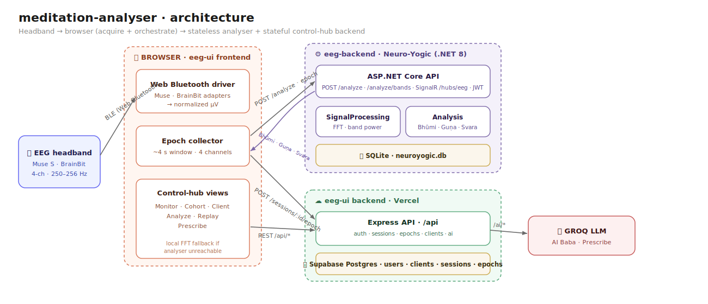
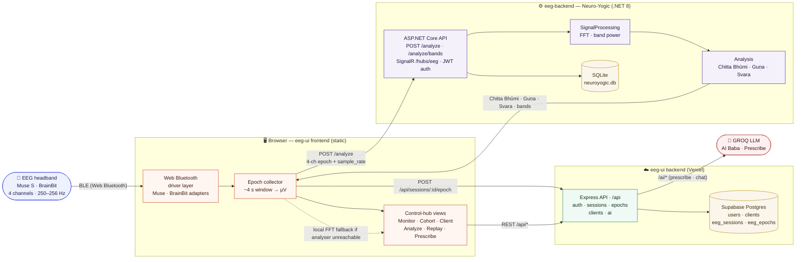
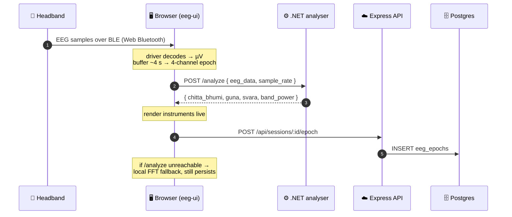

# meditation-analyser

An EEG meditation-analysis platform: a teacher **control hub** that streams live brain activity from a consumer EEG headband, classifies contemplative state through a **Neuro-Yogic** model (Chitta Bhūmi · Guṇa · Svara · band power), and tracks a cohort of practitioners over time.

## Repository layout

| Path | Project | Stack |
|------|---------|-------|
| [`eeg-ui/`](./eeg-ui) | Teacher control-hub UI + live Muse/BrainBit monitor | Express + static HTML/JS · Supabase Postgres · Vercel |
| [`eeg-backend/`](./eeg-backend) | "Neuro-Yogic" EEG classifier / analyser | .NET 8 · SQLite |

`eeg-ui` is a client of `eeg-backend`'s `/analyze` API. Each subproject keeps its own README and build instructions.

---

## Architecture — end to end



<details>
<summary>Same diagram as editable Mermaid source</summary>


</details>

**Two backends, one source of truth.** `eeg-ui`'s Express + Postgres owns all persisted state (users, cohort, sessions, epochs). The .NET analyser is a **stateless classifier** — it turns a window of raw EEG into a contemplative-state reading and returns it; it is never dual-written to. The browser is the orchestrator: it acquires the signal over Web Bluetooth, sends each epoch to the analyser, then persists the result through the Express API.

---

## The per-epoch loop

Every few seconds the browser turns a window of raw EEG into a stored, classified epoch:



---

## What each side does

### `eeg-ui` — teacher control hub
- **Live monitor** — connect a Muse or BrainBit over Web Bluetooth (generic driver layer; any BLE EEG headband can be added), watch the raw waveform, battery, and per-epoch state readout.
- **Cohort / Client** — manage practitioners, bind sessions to clients, track status and history.
- **Analyze** — inline-SVG instruments (band radar, guṇa triangle, chitta-bhūmi ring, svara gauge, depth meter) over a recorded session.
- **Replay** — step through a recorded session epoch by epoch with a phase-colored scrubber.
- **Prescribe** — turn a session into an AI-assisted practice recommendation.
- Express API at `/api` persists to Supabase Postgres; AI features call GROQ.

### `eeg-backend` — Neuro-Yogic analyser (.NET 8)
| Project | Responsibility |
|---------|----------------|
| `NeuroYogic.Api` | ASP.NET Core endpoints (`/analyze`, `/analyze/bands`, `/sessions`, `/auth`), SignalR hub `/hubs/eeg`, JWT auth |
| `NeuroYogic.SignalProcessing` | FFT, band-power extraction |
| `NeuroYogic.Analysis` | Chitta Bhūmi / Guṇa / Svara classification |
| `NeuroYogic.Domain` | Core entities |
| `NeuroYogic.Infrastructure` | Persistence (EF Core · SQLite) |

Runs zero-config on SQLite: `dotnet run --project eeg-backend/src/NeuroYogic.Api`.

---

## Getting started

```bash
# Analyser (.NET 8, SQLite — no setup)
dotnet run --project eeg-backend/src/NeuroYogic.Api

# Control hub (Node) — see eeg-ui/README for env + DB setup
cd eeg-ui && npm install && npm run dev   # → http://localhost:3000
```

Open the hub in **Chrome or Edge on desktop** (Web Bluetooth is required to connect a headband), or use **Demo** mode for synthetic EEG.
